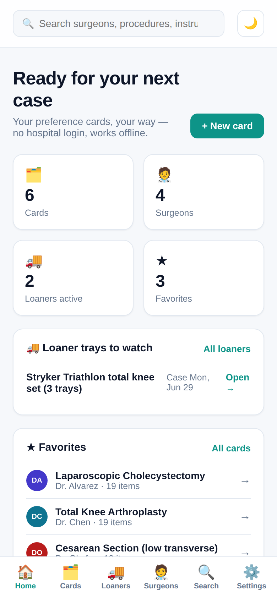
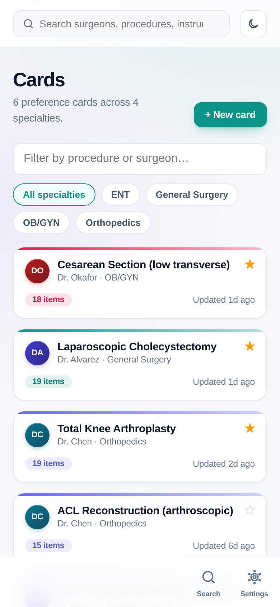
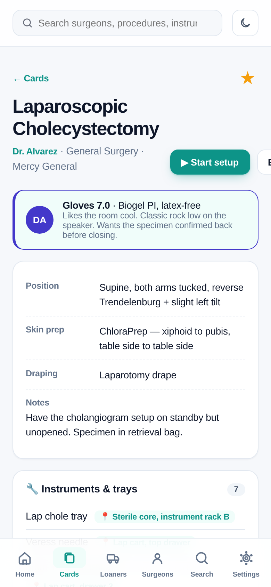
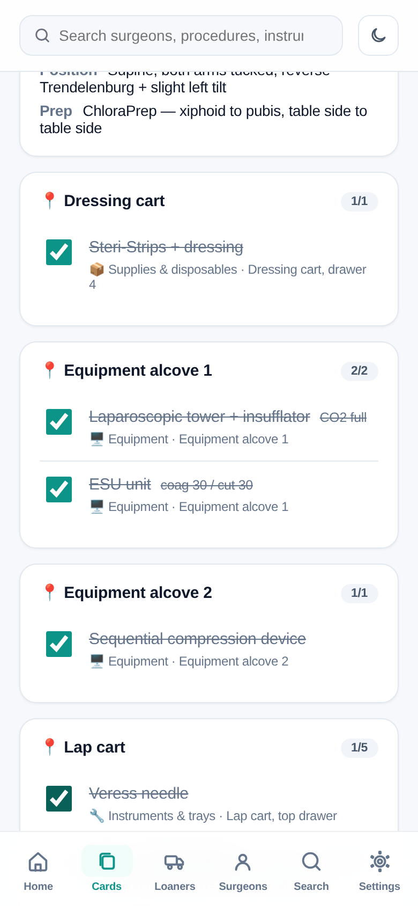

# CaseReady

A modern, fast surgical **preference-card** app — built as a better answer to
[PrefCard](https://apps.apple.com/us/app/prefcard/id1152824233).

Scrub techs and circulating nurses keep a mental rolodex of how every surgeon
wants every case set up — positioning, prep, trays, sutures, supplies, the
quirks. CaseReady puts it in your pocket, and it belongs to **you**, not a
hospital admin.

> **The wedge** (straight from PrefCard's App Store reviews): a 1★ reviewer — a
> surgical travel tech — wanted "a singular place to store and update my own
> personal preference cards for the surgeons that I work with… I only want this
> for me! I shouldn't need to get approval from anyone." CaseReady is exactly
> that tool: personal, offline, no approvals, no empty screens.

> **Try it:** `npm install && npm run dev`. It opens pre-loaded with a realistic
> demo library (4 surgeons, 6 fully-populated cards) so nothing is empty. Tap
> **Use it now — no account** to go straight in. Everything is stored locally.

<p align="center">
  
  
  
  
</p>

## What CaseReady does differently

| What techs hate about the old app | CaseReady's answer |
| --- | --- |
| **Needs hospital/admin approval to use.** | **Yours alone.** One tap to start — no account, no approval, no facility login. |
| **Useless if you're a traveler** moving between facilities. | Built for travelers: your library is on your phone and goes everywhere you do. |
| **"Extremely bad design… a total waste of time."** | Clean, fast, native-feeling UI with light/dark mode and a phone bottom-nav. |
| Empty and confusing out of the box. | Opens preloaded with realistic example cards across 4 specialties. |
| Locked-in data. | **Export** your whole library to JSON or **share** any card as plain text. |
| Useless when the OR Wi-Fi drops. | **Fully offline** (installable PWA + native shell). |

## Features

- **Cards library** — every preference card, grouped by surgeon and procedure,
  filterable by specialty, favorites pinned. Each card carries position, skin
  prep, draping, notes, and five item sections: instruments & trays, sutures,
  supplies, medications & irrigation, equipment.
- **Setup mode** — the differentiator. Turn any card into a live **pull-list**
  with big tap targets; check items off as you gather them; a progress bar hits
  **"Case ready"** at 100%. Progress is saved, so locking your phone mid-setup
  loses nothing.
- **Per-facility locations** — locations ("Lap cart · drawer 2") are shared,
  facility-scoped records, not free text. Pick from the facility's set so names
  stay consistent; **edit a location once and it updates on every card** that
  references it. Manage each hospital's set on the Facilities screen. Setup mode
  **auto-groups the pull-list by area**, so you clear one cart/cabinet at a time
  — what a traveling tech in an unfamiliar OR needs most.
- **Surgeons** — a profile per surgeon with **glove size**, glove type, facility,
  and free-text **quirks** ("tourniquet up before prep," "no chatter on
  closing") surfaced right where you set up.
- **Global search** — one box across surgeons, procedures, and every item line,
  ranked by relevance ("knee", "Vicryl", "tourniquet", a surgeon's name).
- **Share, archive & transfer** — export a card to a file and send it; the
  recipient imports it as their own editable copy (a *foundation* to build on),
  matched into their surgeons/facilities/locations by name. Build a personal
  archive of cards from many hospitals. Surgeons can **copy a card to another
  facility** in one tap (locations remap to the new site automatically).
- **Bulk import** — facilities can upload preexisting cards from a CSV/Excel
  export (Genesis, SIS / S3, or a spreadsheet) with a downloadable template.
- **Optional account + Face ID** — use it anonymously, or add a local account to
  lock the app. Nothing leaves your device.
- **Offline-first PWA** wrapped for the App Store with **Capacitor**.

## Tech & structure

Vite + React + TypeScript, no backend. State lives in a small store
(`src/state/store.tsx`) persisted to `localStorage`.

```
src/
  lib/        search (+ tests), share/export (+ tests), formatters
  state/      store, optional auth, seeded demo library
  pages/      Dashboard, Cards, CardDetail, CardEdit, SetupMode,
              Surgeons, SurgeonDetail, Search, Settings, Login
  components/ Sidebar, BottomNav, TopBar, Avatar, ThemeToggle
```

## Commands

```bash
npm install
npm run dev        # local dev server
npm run build      # type-check + production build (PWA: manifest + service worker)
npm run test       # unit tests + render smoke tests
npm run icons      # regenerate app icons + splash from the vector brand mark
npm run cap:sync   # build + sync the native iOS/Android projects
```

## Shipping to TestFlight & the stores

CaseReady is an installable PWA wrapped with **Capacitor**, with a one-click
**GitHub Actions → TestFlight** pipeline (`.github/workflows/ios-testflight.yml`)
and Fastlane lanes for a Mac. The runbooks live in [`docs/`](docs/):

- [`docs/TESTFLIGHT.md`](docs/TESTFLIGHT.md) — get it on your iPhone (cloud or Mac)
- [`docs/PUBLISHING.md`](docs/PUBLISHING.md) — full App Store / Play Store release
- [`docs/STORE_LISTING.md`](docs/STORE_LISTING.md) — names, description, keywords
- [`docs/PRIVACY.md`](docs/PRIVACY.md) — privacy policy (we collect nothing)

The final upload needs your Apple Developer account and code signing — see
TESTFLIGHT.md for the exact, minimal steps.

## Notes & honest limitations

This is a polished **single-device** app: your library lives on your phone and
is yours to export. A future version could add optional encrypted cloud backup
and multi-device sync — the state is plain serializable data and the optional
account is already structured to drop a hosted backend in behind it without UI
changes. The product decision — your cards are *yours*, no approvals — is the
point, and it's the direct answer to what the old app's reviewers asked for.

> Do not store patient-identifying information in CaseReady. Preference cards
> describe surgeon/procedure setup, not patients.
